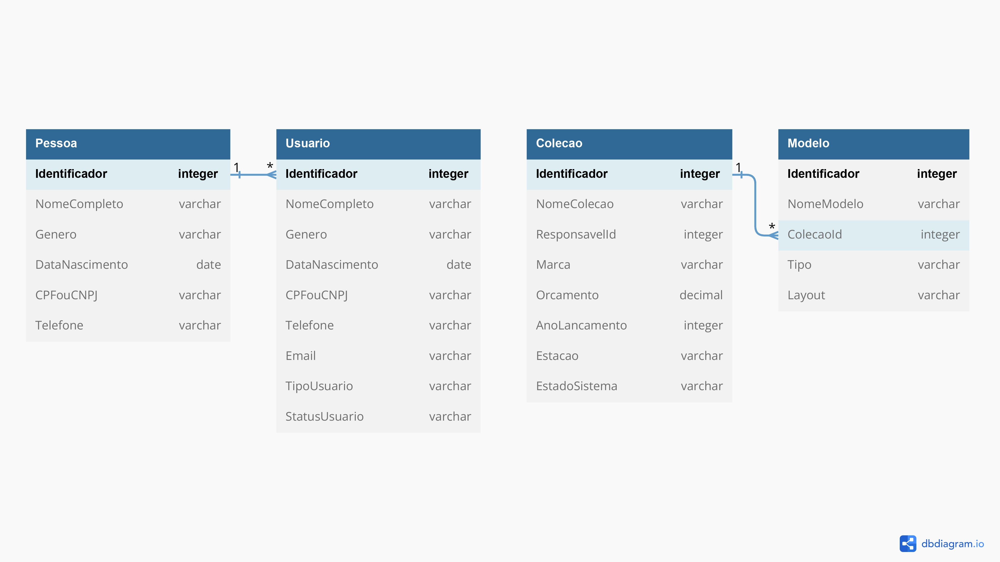

# LAB-Clothing-Collection-BackEnd

 Gizelle Emanuel da Silva

## INTRODUÇÃO

<em> A LABFashion LTDA, empresa líder no segmento tecnológico para gestão de moda, está com um projeto novo intitulado LAB Clothing Collection, um software audacioso para gestão de coleções de moda no setor de vestuário.</em>

<em> A LABFashion LTDA deseja, através do software LAB Clothing Collection, gerenciar suas coleções e modelos de vestuário criados por determinados usuários da equipe. Para criar a aplicação Back-End do software, foi desesncolvida utilizando o C# e .Net Utilizando o banco de dados SQL Server Express.</em>

## ROTEIRO DA APLICAÇÃO
### FORMATO DO SISTEMA 

<em> O sistema deve conter os tipos de cadastros abaixo, cada um com suas características. </em>
  

**O cadastros de Usuário, deve ser derivado da classe Pessoa, que possui os seguintes atributos:**
<pre>
● Identificador: Um número que deve ser incrementado automaticamente.
● Nome Completo: Deve ser um texto.
● Gênero: Deve ser um texto.
● Data de Nascimento: Obrigatório, data válida.
● CPF ou CNPJ: Deve ser texto.
● Telefone: Deve ser texto.
</pre>
| Solução |  Serviço |
|----------| ----------|
|  Cadastro de Usuário: | <em> Serviço de cadastro de Usuário, cuja entidade deve herdar de Pessoa. | 
|  Atualização dos dados de Usuário: | <em>   Serviço para alterar/atualizar os dados de determinado usuário e que o usuário do sistema poderá alterar o status sempre que necessário.  |
|  Atualização do Status de Usuário: | <em>  Serviço para alterar/atualizar o status de determinado usuário. |
|  Listagem de Usuários: | <em>   Serviço de listagem de usuários cadastrados. |
|  Listagem de Usuários pelo identificador: | <em> Serviço de consulta de usuário pelo seu código identificador. |
 
  
**Cadastro de Coleções, Serviço de cadastro de Coleção, cuja entidade deve possuir os seguintes atributos:** 
 <pre>
● Identificador: Um número que deve ser incrementado automaticamente.
● Nome da Coleção: Obrigatório, deve ser texto.
● Identificador do Responsável: Obrigatório, deve ser numérico.
● Marca: Obrigatório, deve ser texto.
● Orçamento: Obrigatório, deve ser numérico.
● Ano de Lançamento: Obrigatório, data válida.

● Estação: Obrigatório com as seguintes opções:
■ Outono
■ Inverno
■ Primavera
■ Verão

● Estado no Sistema: Obrigatório com as seguintes opções:
■ Ativa
■ Inativa
</pre>
| Solução |  Serviço |
|----------| ----------|
|  Atualização dos dados de Coleções: | <em> Serviço para alterar/atualizar os dados de determinada coleção e que o usuário do sistema poderá alterar sempre que necessário.  | 
|  Atualização do Estado da Coleção no sistema: | <em> Serviço para alterar/atualizar o estado da coleção no sistema e que o usuário do sistema poderá alterar este estado sempre que necessário.  |
|  Listagem de Coleções: | <em>  Serviço de listagem de coleções cadastrados. |
|  Listagem de Coleção pelo identificador: | <em> Serviço de consulta de coleções pelo seu código identificador. |
|  Exclusão de Coleção: | <em> Serviço para excluir uma coleção pelo código identificador que só permitirá a exclusão de uma coleção que esteja arquivada (inativa) e que não possua modelos vinculados.  |
  
**Cadastro de Modelos, serviço de cadastro de Modelos, cuja entidade deve possuir os seguintes atributos:** 
 <pre>
● Identificador: Um número que deve ser incrementado automaticamente.
● Nome do modelo: Obrigatório, deve ser texto.
● Identificador da Coleção Relacionada: Obrigatório, deve ser numérico.

● Tipo: Obrigatório com as seguintes opções:
■ Bermuda
■ Biquini
■ Bolsa
■ Boné
■ Calça
■ Calçados
■ Camisa
■ Chapéu
■ Saia

● Layout: Obrigatório com as seguintes opções:
■ Bordado
■ Estampa
■ Liso
</pre>
| Solução |  Serviço |
|----------| ----------|
|  Atualização dos dados de Modelos: | <em> Serviço para alterar/atualizar os dados de determinado modelo e que o usuário do sistema poderá alterar sempre que necessário.  | 
|  Listagem de Modelos: | <em> Serviço de listagem de modelos cadastrados.  |
|  Listagem de Modelo pelo identificador: | <em>  Serviço de consulta de modelos pelo seu código identificador. |
|  Exclusão de Modelo: | <em> Serviço para excluir um modelo pelo código identificador. |
> 
> 

### Modelagem
 

## Orientações 
### Execução da API rest

Para começar, certifique-se de ter instalado o SQL Server Express em sua máquina. Em seguida, realize a instalação do Visual Studio 2019 ou uma versão mais recente. Essa etapa é essencial para prosseguir com o processo.

Após a instalação do Visual Studio, crie um banco de dados com o nome "labclothingcollectionbd". Esse banco de dados será utilizado no projeto que você irá configurar.

Agora, é necessário clonar o repositório correspondente do GitHub, que contém os arquivos necessários para o projeto. Certifique-se de obter o repositório correto.

Em seguida, abra o Visual Studio. Na tela de boas-vindas, clique em "Open a project or solution" (Abrir um projeto ou solução). Navegue até a pasta onde o projeto foi clonado e abra o arquivo de solução (.sln).

Verifique se o arquivo "appsettings.json" contém a string de conexão correta (labclothingcollectionbd). É importante garantir que a configuração esteja correta para estabelecer a conexão com o banco de dados.

Por fim, no Visual Studio, pressione F5 ou vá para "Debug" > "Start Debugging" (Depurar > Iniciar Depuração) para iniciar o projeto. Isso irá compilar e executar o projeto, permitindo que você comece a trabalhar nele. Lembre-se de que é necessário ter o Visual Studio 2019 ou uma versão mais recente para seguir essas etapas com sucesso.

 Back End Engineer

